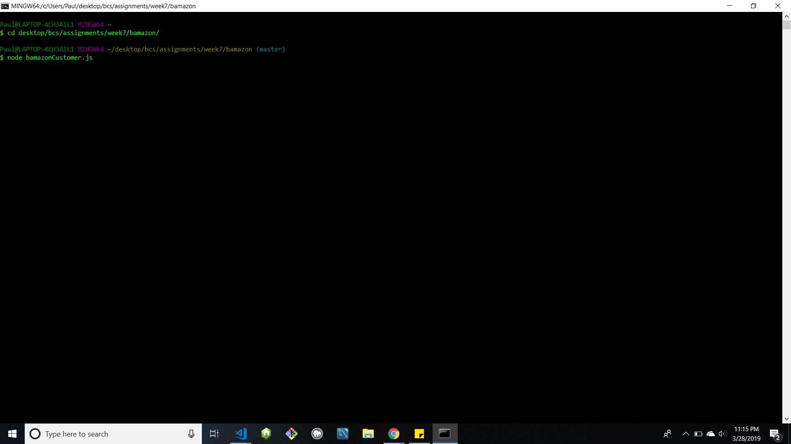
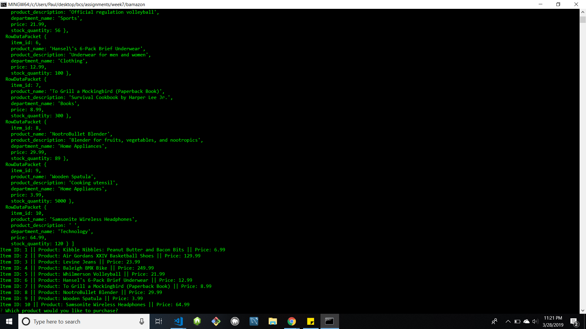
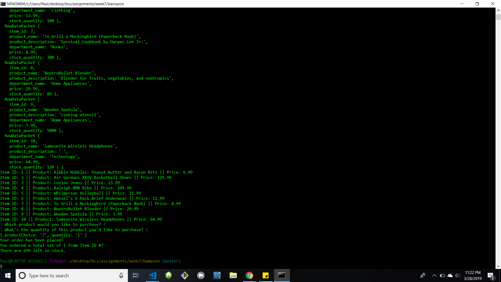

# bamazon
A fake e-commerce site using SQL and Node.js. The purpose of this application is to display to the user the inventory of all the fictional products I wrote out in a javascript file and executed through a MySQL workbench.

The first thing I did was synchronize the directory path in the terminal then push the file into it:

Once entered, the table of products are displayed (from using a for-loop displaying the entire index of the "products" table in MySql. The user is prompted to choose which of the displayed products they would like to purchase. And once a number is entered, they are prompted with the second question asking them the set quantity of that product they would like:

Once the user enter the product ID number and the quantity of that ID, the terminal console logs a confirmation of the transation and gives an update of how much of the item is left in stock:

